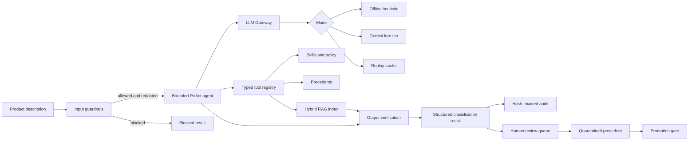

# TariffPilot

> **Evidence-grounded AI decision support for US HTS customs classification.**

[](https://github.com/Ghost24into7/tariffpilot/actions/workflows/ci.yml)
[](https://www.python.org/)
[](https://fastapi.tiangolo.com/)
[](./tests)
[](./docs/PROGRESS.md)
[](./LICENSE)

TariffPilot is a **Python 3.11+ agentic AI system** that helps small importers and exporters investigate likely Harmonized Tariff Schedule (HTS) classifications. It combines hybrid retrieval, a bounded ReAct agent, structured outputs, prompt-injection and PII guardrails, citation verification, policy-as-code, auditability, human review, and offline regression evaluation.

It is designed as a **decision-support platform**, not an autonomous customs filing system or legal-advice product.

## Contents

- [Why TariffPilot](#why-tariffpilot)
- [Architecture](#architecture)
- [Capabilities](#capabilities)
- [Repository map](#repository-map)
- [Quick start](#quick-start)
- [Run the system](#run-the-system)
- [Configuration and modes](#configuration-and-modes)
- [Evaluation and quality gates](#evaluation-and-quality-gates)
- [Security and governance](#security-and-governance)
- [Production-readiness boundaries](#production-readiness-boundaries)
- [Roadmap](#roadmap)
- [Documentation](#documentation)

## Why TariffPilot

Customs classification requires more than generating a plausible code. A useful system must retrieve evidence, reason over product attributes, refuse unsupported conclusions, protect untrusted input, and preserve a reviewable trail.

TariffPilot addresses those requirements with:

| Design goal | Implementation |
| --- | --- |
| **Grounded answers** | Hybrid BM25 + vector retrieval, source-linked citations, quote verification, and leaf-code validation |
| **Controlled agent behavior** | Bounded ReAct loop, typed allowlisted tools, duplicate-call detection, clarification interrupts, and per-request budgets |
| **Safe model integration** | One LLM gateway for rate limits, retries, circuit breaking, caching/replay, routing, and schema-repair |
| **Human accountability** | Confidence floor, restricted-item escalation, hash-chained audit log, review queue, and quarantined precedents |
| **Reproducible engineering** | Deterministic offline mode, frozen test-set hash, pytest coverage, Ruff, Docker, and GitHub Actions |

## Architecture



### Runtime decision flow

```text
request
  -> normalize, detect injection, redact PII, enforce size limits
  -> search HTS nodes, rulings, skills, and approved precedents
  -> reason in a bounded ReAct loop
  -> verify leaf code, citations, and quoted evidence
  -> apply confidence and restricted-item policy
  -> return classified / needs_review / needs_info / abstained / blocked
  -> record privacy-preserving audit event
```

## Capabilities

| Capability | What it does | Status |
| --- | --- | :---: |
| Hybrid RAG | BM25 plus deterministic hash embeddings with reciprocal-rank fusion | ✅ |
| ReAct agent | Bounded steps, tool use, clarification, loop detection, typed decisions | ✅ |
| LLM gateway | RPM/RPD limits, cache/replay, retries, breaker, budgets, model routing | ✅ |
| Structured outputs | Validated classification schemas and JSON-only prompt contracts | ✅ |
| Input guardrails | Prompt-injection heuristics, PII redaction, card-number detection, size limits | ✅ |
| Output guardrails | HTS existence/leaf checks, citation resolution, quote grounding | ✅ |
| Governance | Policy-as-code, confidence floor, restricted-item review, reviewer allowlist | ✅ |
| Auditability | SQLite hash chain, trace IDs, retention, payload erasure, verification CLI | ✅ |
| Human review | Review queue, reviewer resolution, precedent quarantine and promotion | ✅ |
| Interfaces | CLI, FastAPI endpoints/SSE, Streamlit UI | ✅ / optional |
| Observability | JSONL tracing with optional OpenTelemetry bridge | ✅ / optional |
| Evaluation | Frozen golden set, red-team cases, metrics, CI regression gate | ✅ |
| Live data | USITC HTS and CBP CROSS ingestion workflow | 🔧 next step |

## Repository map

```text
tariffpilot/
├── src/tariffpilot/
│   ├── agent/          # ReAct loop and typed tools
│   ├── api/            # FastAPI service and SSE endpoint
│   ├── evals/          # Evaluation metrics and gates
│   ├── governance/     # Policy, audit log, review queue
│   ├── guardrails/     # Input and output safety controls
│   ├── learning/       # Precedents and reflection
│   ├── llm/            # Gateway, offline client, Gemini adapter
│   ├── obs/            # Tracing and optional OpenTelemetry
│   ├── rag/            # Corpus loading and hybrid retrieval
│   ├── ui/             # Streamlit interface
│   ├── schemas.py      # Validated structured result types
│   └── service.py      # Application composition root
├── data/
│   ├── golden/         # Frozen dev/test evaluation cases
│   ├── redteam/        # Injection and PII test cases
│   └── sample/         # Small synthetic HTS/rulings corpus
├── prompts/            # Versioned YAML prompt templates
├── skills/             # Progressive SKILL.md domain instructions
├── policy/             # Runtime safety and evaluation policy
├── tests/              # Offline unit and integration tests
├── docs/               # Specification, ADRs, model card, risks, evals
├── Dockerfile          # API container
├── docker-compose.yml  # App and optional Phoenix observability
└── pyproject.toml      # Package metadata and dependency groups
```

## Quick start

### 1. Install in a virtual environment

```bash
python -m venv .venv
# macOS/Linux
source .venv/bin/activate
# Windows PowerShell
.\.venv\Scripts\Activate.ps1

pip install -e ".[dev]"
```

### 2. Run the deterministic offline path

```bash
make test
make demo
make gate
```

The offline path does not call an external model, does not require an API key, and is suitable for local development and CI.

Example:

```bash
python -m tariffpilot classify "Men's cotton knitted t-shirt, short sleeve"
```

## Run the system

| Use case | Command |
| --- | --- |
| Classify one product | `python -m tariffpilot classify "product description"` |
| Run tests with coverage | `make test` |
| Run linting | `make lint` |
| Evaluate development set | `make eval` |
| Run frozen regression gate | `make gate` |
| Verify audit chain | `python -m tariffpilot verify-audit` |
| List pending reviews | `python -m tariffpilot review-list` |
| Start FastAPI | `make run` |
| Start Streamlit UI | `make ui` |
| Start API plus Phoenix | `docker compose --profile obs up` |

### API surface

With the API extra installed, `make run` exposes:

| Endpoint | Purpose |
| --- | --- |
| `GET /healthz` | Health and audit-chain status |
| `GET /metrics` | Gateway, quota, and review counters |
| `POST /classify` | Synchronous classification |
| `POST /classify/stream` | Server-sent event classification stream |
| `GET /review-queue` | Authorized reviewer queue |
| `POST /review/{item_id}` | Resolve a review item |
| `GET /trace/{trace_id}` | Authorized trace lookup |

Interactive API documentation is available at `/docs`.

## Configuration and modes

Copy `.env.example` to a local, ignored `.env` file. Never commit `.env` or credentials.

| Mode | `TP_MODE` | External quota | Intended use |
| --- | --- | ---: | --- |
| Offline | `offline` | None | Development, tests, demos, CI |
| Gemini | `gemini` | Gemini API | Live experimentation on public data |
| Replay | `replay` | None | Deterministic runs from recorded gateway responses |

Optional dependency groups:

```bash
pip install -e ".[dev,api,gemini,ui]"
pip install -e ".[otel]"
```

For a live Gemini smoke test:

```bash
TP_MODE=gemini python scripts/live_smoke.py
```

Use public, non-sensitive product data only. Free-tier model prompts may be retained or used by the provider according to the provider's terms.

## Evaluation and quality gates

The repository includes a small synthetic corpus and frozen evaluation set to validate the engineering harness—not to claim production classification accuracy.

Current offline evidence:

| Measure | Result |
| --- | ---: |
| Offline tests | **69 passed** |
| Total coverage | **80%** |
| Test-set hallucination rate | **0.0** |
| Test-set citation faithfulness | **1.0** |
| Agent test-set accuracy@6 | **0.7778** |

See [docs/EVALS.md](./docs/EVALS.md) for the full table and [docs/PROGRESS.md](./docs/PROGRESS.md) for known limitations. The frozen test set is protected by [data/golden/test.jsonl.sha256](./data/golden/test.jsonl.sha256).

## Security and governance

- All model calls pass through [`llm/gateway.py`](./src/tariffpilot/llm/gateway.py).
- Product input is normalized and checked for prompt injection before agent processing.
- Email addresses, phone numbers, PANs, SSNs, and valid payment-card numbers are redacted.
- Tools are typed, allowlisted, traced, and time-limited.
- Outputs are schema-validated and checked against retrieved source data.
- Audit entries store an input hash instead of raw product input.
- Low-confidence, restricted, unsupported, or ambiguous cases can require human review.
- No shell or arbitrary network tool is exposed to the agent.

Read [SECURITY.md](./SECURITY.md) before deploying and report vulnerabilities privately through GitHub security advisories.

## Production-readiness boundaries

This repository is an intentionally honest reference implementation:

- The bundled tariff is a **17-line sample**, not the complete current US HTS.
- Bundled rulings are **synthetic fixtures**, not official CBP CROSS data.
- Sample duty rates must be verified against the current USITC schedule.
- Gemini, FastAPI, Streamlit, and OpenTelemetry adapters are optional and need live-environment validation.
- There is no LLM-as-judge yet.
- The system provides decision support and does not replace a licensed customs professional, official ruling, or customs filing review.

## Roadmap

- [ ] Ingest and date-split real public USITC HTS and CBP CROSS data.
- [ ] Run and record a live Gemini evaluation in replay mode.
- [ ] Exercise API, Streamlit, and OpenTelemetry paths in CI or a staging environment.
- [ ] Add an LLM-judge metric for reasoning quality.
- [ ] Deploy a free-tier demonstration environment.

## Documentation

- [System specification](./docs/SPEC.md)
- [Architecture decisions](./docs/adr/)
- [Model card](./docs/MODEL_CARD.md)
- [Risk register](./docs/RISK_REGISTER.md)
- [Evaluation methodology](./docs/EVALS.md)
- [Project progress](./docs/PROGRESS.md)
- [Security policy](./SECURITY.md)

## Engineering profile

**Python · AI agents · ReAct · RAG · BM25 · vector retrieval · Gemini · structured outputs · prompt engineering · PII redaction · prompt-injection defense · policy-as-code · human-in-the-loop · audit logging · FastAPI · Streamlit · OpenTelemetry · SQLite · Docker · pytest · Ruff · GitHub Actions · CI/CD**

## License

See [LICENSE](./LICENSE).
